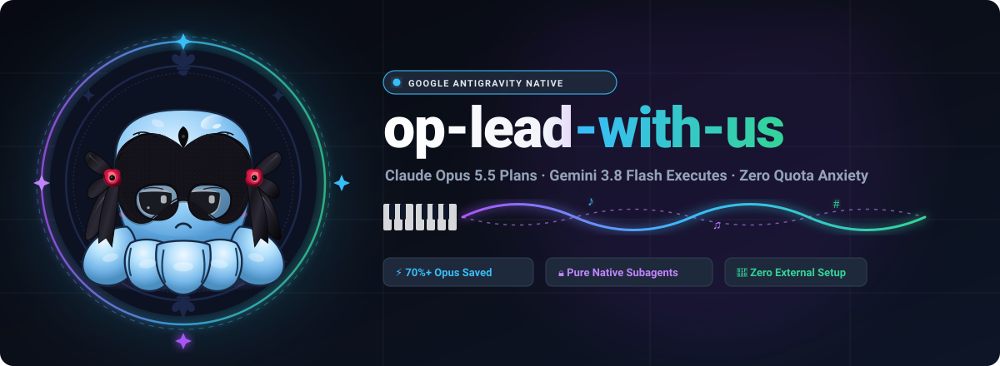

<p align="center">
  
</p>

<p align="center">
  <a href="#english">English</a> | <a href="#-简体中文">简体中文</a>
</p>

<p align="center">
  <a href="https://antigravity.google"></a>
  
  
  <a href="LICENSE"></a>
  
</p>

<p align="center">
  <b>Hire Gemini Flash as staff for Claude Opus 5.5 — natively inside Google Antigravity.</b><br>
  Opus plans, guides, and accepts. Flash explores, writes, and tests. Zero external CLI or proxies required.
</p>

<p align="center">
  <b><a href="#quick-start">Quick Start</a> · <a href="#why-op-lead-with-us">Why</a> · <a href="#roles">Roles</a> · <a href="#architecture">Architecture</a> · <a href="#license">License</a></b>
</p>

---

<a name="english"></a>
## What & Why

**`op-lead-with-us`** is an Antigravity-native multi-model orchestration plugin.

Claude Opus 5.5 provides exceptional reasoning and system architecture skills, but consuming expensive Opus quota on repetitive repository exploration, continuous editing, and running unit tests is inefficient.

This plugin establishes an automated division of labor directly inside Antigravity:
* **Claude Opus 5.5 (Lead)** acts as the lead architect (`model: inherit`). It frames requirements, generates task packets, reviews findings, and makes final acceptance decisions.
* **Gemini 3.8 Flash (Workers)** operate as background subagents (`model: flash`). They handle repository search, file modifications, test commands, and independent sanity reviews.

**Core Benefits:**
* **Save 60%–80% Opus Quota**: Heavy token operations are offloaded to Flash.
* **Zero External Dependencies**: Pure Antigravity native (`invoke_subagent`). No Node server, no Claude Code CLI, no external proxies.
* **Context Preservation**: Test logs and file dumps remain isolated in worker subagent sessions.

---

## Roles

| Persona | Identifier | Model | Permissions & Scope |
| :--- | :--- | :--- | :--- |
| **Lead Architect** | `op-lead-with-us` | **Claude Opus 5.5** (`inherit`) | High-level planning, task breakdown, evidence evaluation, acceptance. No routine file edits. |
| **Researcher** | `agy-researcher` | **Gemini Flash** (`flash`) | Read-only codebase reconnaissance, dependency mapping, finding interfaces. No code edits. |
| **Implementer** | `agy-implementer` | **Gemini Flash** (`flash`) | Code editing, file replacement, test command execution. Max 2 self-repair cycles. |
| **Reviewer** | `agy-reviewer` | **Gemini Flash** (`flash`) | Independent audit of git diffs and test logs against acceptance criteria. No writes. |

---

## Architecture

```
                       [ User Prompt ]
                              │
                              ▼
           ┌─────────────────────────────────────┐
           │      Claude Opus 5.5 (Lead)         │
           │         op-lead-with-us             │
           │  Architecture, Plan, Task Packet    │
           └──────────────────┬──────────────────┘
                              │ invoke_subagent
         ┌────────────────────┼────────────────────┐
         ▼                    ▼                    ▼
  [ agy-researcher ]   [ agy-implementer ]   [ agy-reviewer ]
   (Gemini Flash)       (Gemini Flash)       (Gemini Flash)
   Read-only survey     Code edits & tests   Independent audit
```

---

## Quick Start

### 1. Install Globally (Machine-Wide)

Clone the repository and install it to your user configuration directory:

```powershell
git clone https://github.com/your-username/op-lead-with-us.git
cd op-lead-with-us
npm run install:global
```

*(To uninstall: `npm run uninstall:global`)*

### 2. Run in Antigravity

1. Open or restart **Antigravity 2.0+**.
2. Start a **New Conversation** (`Ctrl+N`).
3. Select **`op-lead-with-us`** in the Agent selector.
4. Select **`Claude Opus 5.5`** in the Model selector.
5. Send your coding request.

The Lead will automatically coordinate Gemini Flash subagents in the background.

---

## Verification & Tests

The plugin includes an offline test suite validating schemas, model routing constraints, and staging safeguards:

```powershell
npm run validate   # Check manifest and agent declarations
npm test           # Run 21 regression test cases
npm run package    # Generate release ZIP with SHA256 checksum
```

---

<a name="-简体中文"></a>
## 🇨🇳 简体中文

### 概述

**`op-lead-with-us`** 是专为 **Google Antigravity** 设计的原生多模型协作插件。

让 **Claude Opus 5.5** 负责高阶系统架构、需求拆解与最终验收，将繁重的高 Token 消耗操作（文件检索、代码修改、单元测试）交由毫秒级极速响应的 **Gemini 3.8 Flash** 子 Agent 执行。吉祥物为一只佩戴银色假面的智慧蓝章鱼，象征以多爪多线程从容调度多模型。

### 为什么选择它？

* **大幅节省高阶算力**：将 70% 以上的代码读写与试错执行转嫁给 Flash。
* **原生免配**：不依赖 Claude Code、Codex、agy CLI 或任何第三方网络代理，直接利用 Antigravity 官方子 Agent（`invoke_subagent`）机制。
* **干净的上下文**：大量生成的代码和终端测试日志留在子会话中，主对话上下文始终保持精简。

### 角色分工

* **`op-lead-with-us` (Opus 5.5)**：主架构师。拆解任务包，监督执行，最终验收，不亲自敲碎代码。
* **`agy-researcher` (Gemini Flash)**：只读调研员。毫秒级探查接口与现有架构，严禁修改文件。
* **`agy-implementer` (Gemini Flash)**：执行员。负责文件编写、替换并运行本地测试命令，限定 2 轮自主修复上限。
* **`agy-reviewer` (Gemini Flash)**：独立审查员。核对变更 Diff 与测试证据，杜绝越权修改。

### 快速上手

```powershell
# 1. 全局安装
git clone https://github.com/your-username/op-lead-with-us.git
cd op-lead-with-us
npm run install:global

# 2. 在 Antigravity 桌面端
# - 新建会话 (Ctrl+N)
# - Agent 选择器选择: op-lead-with-us
# - 模型选择器选择: Claude Opus 5.5
# - 开始对话！
```

---

## License

Distributed under the **MIT License**. See [`LICENSE`](LICENSE) for details.
