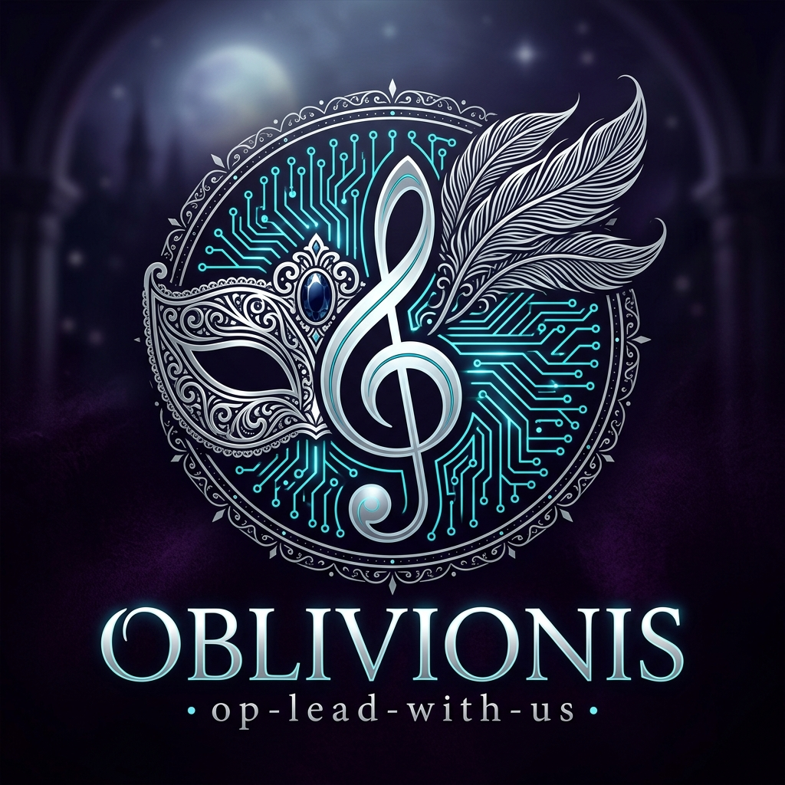

<p align="center">
  
</p>

<h1 align="center">🎭 op-lead-with-us</h1>

<p align="center">
  <b>"Oblivious to token anxiety — Opus conducts the score, while Flash plays the storm."</b><br>
  <em>A native multi-model theatrical band plugin for Google Antigravity.</em>
</p>

<p align="center">
  <a href="#-overview">English</a> | <a href="#-中文详细指南">简体中文</a>
</p>

<p align="center">
  
  
  
  
  
</p>

---

<p align="center">
  
</p>

## 📖 Overview

**`op-lead-with-us`** (pronounced *ob-liv-ious*, an homage to **Oblivionis** from *BanG Dream! Ave Mujica*) is an open-source, native multi-model orchestration plugin built exclusively for **Google Antigravity**.

In real-world software engineering with LLMs, senior models like **Claude Opus 5.5** provide unmatched reasoning, architectural vision, and code taste — but burning scarce Opus quota on tedious repository scans, file writes, and trial-and-error test runs is an immense waste.

**`op-lead-with-us`** transforms your Antigravity IDE into a symphonic masquerade band:
* **The Maestro (Claude Opus 5.5)** stands at the center, defining specifications, breaking down tasks, and conducting the movement.
* **The Ensemble (Gemini 3.8 Flash)** shreds through files, explores dependencies, edits code, and executes test suites at lightning speed in background subagent sessions.
* **Result**: **60%–80% Opus quota saved**, zero context pollution, and pure native execution without third-party proxies or external CLI bridges.

---

## 🎸 The Band Lineup (Role Architecture)

```
                       [ 👤 User Request ]
                                │
                                ▼
         ┌──────────────────────────────────────────────┐
         │       🎹 Maestro (Claude Opus 5.5)           │
         │           opus-staff-lead                    │
         │  Architectural Planning & Final Acceptance   │
         └──────────────────────┬───────────────────────┘
                                │
          Native Subagent Invocations (invoke_subagent)
                                │
       ┌────────────────────────┼────────────────────────┐
       ▼                        ▼                        ▼
 🔍 Synthesizer Scout      ⚡ Lead Shredder         🛡️ Bass & Mastering
   (Gemini Flash)           (Gemini Flash)           (Gemini Flash)
   agy-researcher          agy-implementer           agy-reviewer
 ──────────────────       ──────────────────       ──────────────────
 • Read-only discovery    • Code editing & diff    • Independent audit
 • AST & test analysis    • Automated test runs    • Regression check
 • Zero code writes       • 2 repair cycles max    • No writes allowed
```

| Band Position | Agent Identifier | Model Tier | Persona & Responsibility |
| :--- | :--- | :--- | :--- |
| **🎹 Maestro & Keyboards** | `opus-staff-lead` | **Claude Opus 5.5**<br>(`inherit`) | **The Composer (Oblivionis)**. Formulates task packets, holds architectural veto power, accepts deliverables. Never performs routine edits directly. |
| **🔍 Synthesizer & Scout** | `agy-researcher` | **Gemini Flash**<br>(`flash`) | **Frequency Reconnaissance**. Deep read-only repository sweeps. Pinpoints interfaces and test runners with zero side-effects. |
| **⚡ Lead Guitar & Drums** | `agy-implementer` | **Gemini Flash**<br>(`flash`) | **Rhythm & Heavy Lifting**. Rapid code writing, file replacement, and test suite execution. Bounded by a strict 2-cycle auto-repair budget. |
| **🛡️ Bass & Mastering** | `agy-reviewer` | **Gemini Flash**<br>(`flash`) | **Sound Engineering & Audit**. Independent verification of git diffs and test logs against the original specification. Completely isolated from the implementer. |

---

## ⚡ Why `op-lead-with-us`?

| Metric | All-in Claude Opus 5.5 | External CLI / Proxy Bridges | **🎭 `op-lead-with-us`** |
| :--- | :--- | :--- | :--- |
| **Opus Quota Consumption** | 🚨 Exhausted within hours | ⚠️ Moderate | **⚡ 70%+ Saved (Only high-level decisions)** |
| **Execution Velocity** | 🐢 Slow (Heavy reasoning lag) | ⚠️ Inter-process delay | **🚀 Blazing fast (Flash sub-second response)** |
| **External Dependencies** | None | ❌ Requires Node, agy CLI, Python | **✅ Pure Antigravity Native (Zero setup)** |
| **Security & Account Safety** | Official | ⚠️ Reverse-engineered proxies risk bans | **🔒 100% Native Google Sandbox & Official Auth** |
| **Context Window Health** | 💥 Flooded with terminal logs | ⚠️ Segmented | **✨ Pristine (Worker logs isolated to subagents)** |

---

## 🚀 Quick Start (Under 1 Minute)

### 1. Global Installation (Any Workspace)
Clone and install to your Antigravity global configuration directory in one command:

```powershell
git clone https://github.com/your-username/antigravity-opus5-5-agy-opus-github.git
cd antigravity-opus5-5-agy-opus-github
npm run install:global
```

*(To uninstall globally later: `npm run uninstall:global`)*

### 2. Launch in Antigravity Desktop
1. Open or restart **Antigravity 2.0+**.
2. Start a **New Conversation** (`Ctrl + N`).
3. In the **Primary Agent** dropdown, select: **`opus-staff-lead`**.
4. In the **Model** dropdown, select: **`Claude Opus 5.5`**.
5. Type your project request!

```text
Prompt Example:
"Build a multi-threaded file downloader with unit tests and a benchmark suite."
```

The Maestro will immediately plan the architecture, spawn the Flash ensemble in background sub-sessions, and present the final verified result.

---

## 🇨🇳 简体中文详细指南

### 🌟 名字的来历与设计哲学

> **"op-lead-with-us"** 谐音 **Oblivionis**（同时包含 `OP` + `lead` + `with-us`，首尾拼合即为 `Opus`）。
> 灵感源自《BanG Dream! It's MyGO!!!!! / Ave Mujica》中丰川祥子（Oblivionis）以坚定意志统御全局的假面乐团哲学。
> 
> 在大模型编程时代，每一个开发者都面临“顶级模型配额昂贵，轻量模型智力有限”的两难。
> 本项目将这一困局化作一场各展所长的**假面交响演出**：
> 让最高智力模型 **Claude Opus 5.5** 担当首席键盘手与指挥（Maestro），
> 驱使 **Gemini 3.8 Flash** 充当极速弹奏的乐手（Ensemble），
> 从而将耗费巨大 Token 的代码编写、文件搜索和单元测试全部转嫁至极速低成本的 Flash，
> 实现 **“忘却一切算力焦虑，唯有架构与代码至上”**。

---

### 📦 核心特性

1. **纯原生零依赖**：不需要额外安装 Claude Code、Codex、agy CLI 或任何第三方 Proxy，完全基于 Google Antigravity 2.0+ 内建的 `Custom Agents` 与 `invoke_subagent`。
2. **多模型真正协同**：在 Antigravity 底层实测证实，主会话为 `claude-opus-5-5`，子会话底层无缝路由至 `gemini-3.8-flash-tiered`。
3. **严格权限隔离**：
   - 调研员只有只读权限，绝不擅自篡改文件；
   - 执行员限定 2 轮自主修复上限，防止死循环空耗；
   - 审查员独立审计，杜绝“既当运动员又当裁判”。

---

### 🛠️ 本地开发与回归测试

本项目配备了完整的脱机测试与自动化流水线（无需联网）：

```powershell
# 1. 静态规则校验 (清单规范、模型路由、工具白名单)
npm run validate

# 2. 运行 21 项原生回归测试套件
npm test

# 3. 将本地代码改动同步至工作区插件副本
npm run stage

# 4. 生成包含 SHA256 校验的发行版压缩包 (outputs/opus-staff-*.zip)
npm run package
```

---

## 📜 License

Distributed under the **MIT License**. See [`LICENSE`](LICENSE) for details.

---

<p align="center">
  <b>🎭 op-lead-with-us</b> — Crafted with passion for the Antigravity Community.<br>
  <i>"Let the curtain rise, and the music play."</i>
</p>
